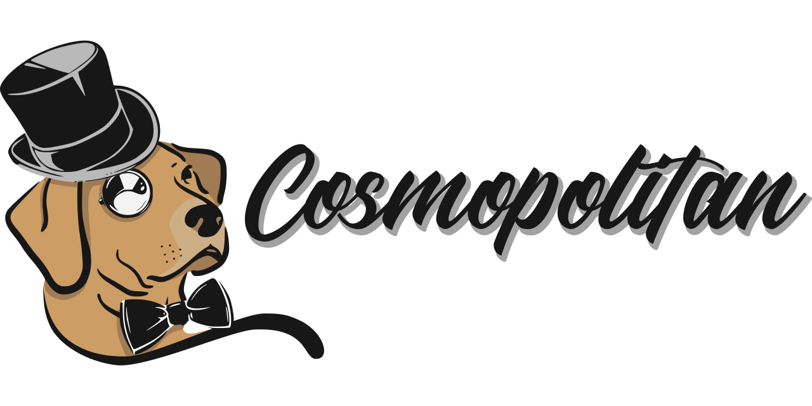

<!-- ALL-CONTRIBUTORS-BADGE:START - Do not remove or modify this section -->

<!-- ALL-CONTRIBUTORS-BADGE:END -->

    

Aplicativo em desenvolvimento para gerenciamento de Meetups do Devs Norte. Estamos gravando o progresso sempre que possível e convidamos todo mundo interessado a participar.

# YouTube

A playlist será disponível em breve nessa seção.

# Sobre o projeto

Queremos fazer reuniões frequentes para desenvolver o back e o front desta app. Atualmente não decidimos frequência nem datas. Se tiver interesse basta entrar em contato com alguem da organização e dizer que quer participar, nem que seja só pra olhar.

As aulas serão gravadas e serão disponibilizadas na seção YouTube.

Já se inscreva no [Canal Youtube Devs Norte](https://www.youtube.com/@DevsNorte)

# Para contribuir e fazer parte do projeto

Fale com a gente no WhatsApp/telegram/Discord!

## Contributors ✨

Thanks goes to these wonderful people ([emoji key](https://allcontributors.org/docs/en/emoji-key)):

<!-- ALL-CONTRIBUTORS-LIST:START - Do not remove or modify this section -->
<!-- prettier-ignore-start -->
<!-- markdownlint-disable -->
<table>
  <tbody>
    <tr>
      <td align="center" valign="top" width="14.28%"><a href="https://www.linkedin.com/in/lubien/"> <b>Lubien</b></a> <a href="#ideas-lubien" title="Ideas, Planning, & Feedback">🤔</a> <a href="https://github.com/devsnorte/cosmopolitan/commits?author=lubien" title="Code">💻</a> <a href="https://github.com/devsnorte/cosmopolitan/pulls?q=is%3Apr+reviewed-by%3Alubien" title="Reviewed Pull Requests">👀</a> <a href="#talk-lubien" title="Talks">📢</a></td>
      <td align="center" valign="top" width="14.28%"><a href="https://iagocavalcante.com/"> <b>Iago Angelim Costa Cavalcante</b></a> <a href="#ideas-iagocavalcante" title="Ideas, Planning, & Feedback">🤔</a> <a href="https://github.com/devsnorte/cosmopolitan/pulls?q=is%3Apr+reviewed-by%3Aiagocavalcante" title="Reviewed Pull Requests">👀</a> <a href="https://github.com/devsnorte/cosmopolitan/commits?author=iagocavalcante" title="Code">💻</a></td>
      <td align="center" valign="top" width="14.28%"><a href="https://thayanacmamore.dev"> <b>Thayana Correa Mamore</b></a> <a href="#ideas-thauska" title="Ideas, Planning, & Feedback">🤔</a> <a href="https://github.com/devsnorte/cosmopolitan/commits?author=thauska" title="Documentation">📖</a> <a href="https://github.com/devsnorte/cosmopolitan/pulls?q=is%3Apr+reviewed-by%3Athauska" title="Reviewed Pull Requests">👀</a></td>
      <td align="center" valign="top" width="14.28%"><a href="https://github.com/juanrtalmeida"> <b>Juan Rodrigues Teixeira Almeida </b></a> <a href="https://github.com/devsnorte/cosmopolitan/commits?author=juanrtalmeida" title="Code">💻</a></td>
      <td align="center" valign="top" width="14.28%"><a href="https://www.linkedin.com/in/joaopedromoraez"> <b>João Pedro Moraes</b></a> <a href="#design-joaopedromoraez" title="Design">🎨</a> <a href="https://github.com/devsnorte/cosmopolitan/commits?author=joaopedromoraez" title="Documentation">📖</a></td>
      <td align="center" valign="top" width="14.28%"><a href="https://github.com/biancassilva"> <b>Bianca</b></a> <a href="#ideas-biancassilva" title="Ideas, Planning, & Feedback">🤔</a> <a href="https://github.com/devsnorte/cosmopolitan/issues?q=author%3Abiancassilva" title="Bug reports">🐛</a> <a href="https://github.com/devsnorte/cosmopolitan/pulls?q=is%3Apr+reviewed-by%3Abiancassilva" title="Reviewed Pull Requests">👀</a></td>
      <td align="center" valign="top" width="14.28%"><a href="https://github.com/ecsistem"> <b>Edson Costa</b></a> <a href="https://github.com/devsnorte/cosmopolitan/commits?author=ecsistem" title="Code">💻</a> <a href="https://github.com/devsnorte/cosmopolitan/issues?q=author%3Aecsistem" title="Bug reports">🐛</a></td>
    </tr>
  </tbody>
</table>

<!-- markdownlint-restore -->
<!-- prettier-ignore-end -->

<!-- ALL-CONTRIBUTORS-LIST:END -->

This project follows the [all-contributors](https://github.com/all-contributors/all-contributors) specification. Contributions of any kind welcome!

# Agradecimento

Agradecemos a cada pessoa que tirou um tempinho para passar por lá, tirar dúvidas, trocar umas ideias e contribuiu de alguma forma.

---

Developed with ❤️ from community to community

